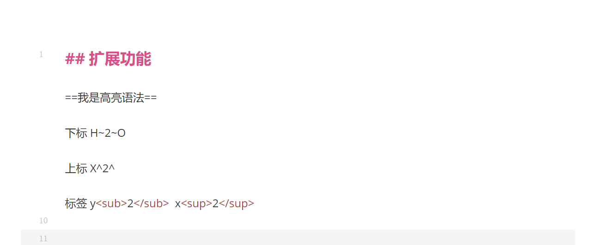

# markdown简易学习记录
一级标题
=  
二级标题
-
文本  
*斜体文本* _斜体文本_  
**文本加粗**  
***文本加粗斜体***
***~~混合文本~~***  
~~中划线~~  
分割线
***  
* * *
- - - - -
<hr/>  

## 列表
### 无序列表
* 第一项
* 第二项
* 第三项
- 新第一项
- 新第二项
- 新第三项
### 有序列表
1. 第一项  
2. 第二项
3. 第三项
### 嵌套列表
1. 第一项
   * 无序列表
   * 2
   * 3
     1. 有序列表
     2. 2
     3. 3
2. 第二项
3. 第三项

### 勾选框
* [x] 第一项
* [ ] 第二项
* [ ] 第三项
1. [x] 第一项
2. [ ] 第二项
3. [ ] 第三项  

### 代码块
````java
public static void main(String[] args) {
int a, b;
Scanner sc = new Scanner(System.in);
a = sc.nextInt();
b = sc.nextInt();//注释
desparate(a, b);
}
````

### 引用
> SpringBoot 是框架的框架，在前面之上又封装了一层，
> 作用就是进一步简化开发。提出了约定大于配置，前面 SSM 中你得写大量的配置文件，SpringBoot 直接给你一套默认配置，并且你maven 导哪个包，对应的配置会自动生效，你只需要写你需要改的一小部分配置，就会自动替换掉默认配置。
> 此外还增加了指标监控 等功能。
> ````java
> public static void main(String[] args) {
>    int a, b;
>   Scanner sc = new Scanner(System.in);
>    a = sc.nextInt();
>    b = sc.nextInt();//注释
>       desparate(a, b);
>    }
> ````
> + 列表  
>   1.有序列表  
>   2.2  
>   3.3
> + 2
> + 3

### 链接和标注
前往网站[百度](https://www.baidu.com)  
多个设置链接[链接1][a]和[链接2][b]

[a]:https://www.baidu.com
[b]:https://www.baidu.com
### 脚注
idea这里不支持这种写法，移步到Typora
### 图片插入
方式一   
  
方式二  
![图片][c]  

[c]:https://image.baidu.com/search/detail?ct=503316480&z=undefined&tn=baiduimagedetail&ipn=d&word=%E8%8D%89%E7%A5%9E&step_word=&lid=10949618217444804839&ie=utf-8&in=&cl=2&lm=-1&st=undefined&hd=undefined&latest=undefined&copyright=undefined&cs=426298741,2649528196&os=3967671444,1402293306&simid=3397711477,284316966&pn=24&rn=1&di=7410818322373017601&ln=1855&fr=&fmq=1728805874602_R&fm=&ic=undefined&s=undefined&se=&sme=&tab=0&width=undefined&height=undefined&face=undefined&is=0,0&istype=0&ist=&jit=&bdtype=0&spn=0&pi=0&gsm=1e&objurl=https%3A%2F%2Fi0.hdslb.com%2Fbfs%2Farchive%2Faeae39c68cf66d41a1a06ae4d23c68d98ffe4611.jpg&rpstart=0&rpnum=0&adpicid=0&nojc=undefined&dyTabStr=MCwzLDEsMiwxMyw3LDYsNSwxMiw5
方式三  


### 表格
|      姓名      | 年龄 | 性别 |
|:------------:| --- | --- |
|      小明      | 12 | 男 |
| 小红dasdsadsa  | 21 | 女 |

### 嵌入html语言
<span style="color:red" >sapn标签</span>  
<p>其他软件甚至支持ifame标签来嵌入网页</p>

### 扩展语法
上标 x<sup>2</sup>  
下标 y<sub>2</sub>

Typora展示



### 数学公式


